## STM32F1 片上 Flash 第一人称 3D 射击游戏

每当提到 3D 第一人称射击游戏，大家很自然就会联想到高性能独显，以及几个G甚至几十G的硬盘存储空间，那么有没有可能在 STM32F103RC 这样一块只有 256KB Flash 的小板子上保存一个大型第一人称射击游戏呢？

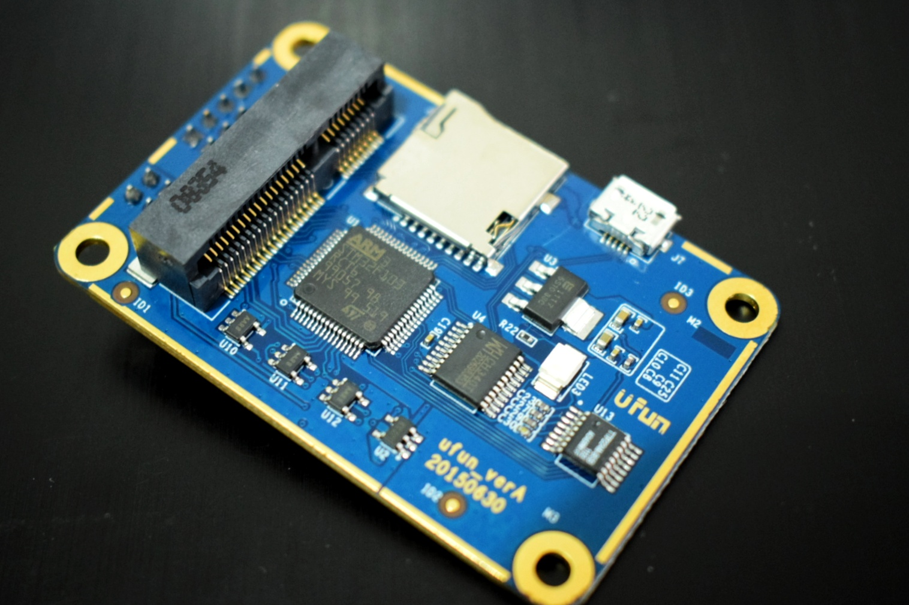

当我们用 USB 线把这块开发板连接到电脑上，就可以看到出现了一个只有100多KB的U盘，这就是 STM32 的片上 Flash 了。

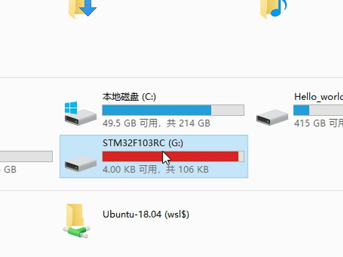

然后可以看到U盘里有一个 90KB 的游戏。

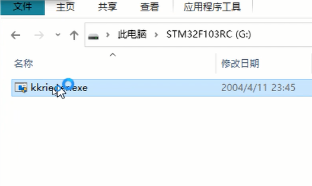

如果我们双击它就启动了一个 STM32 上的第一人称射击游戏。

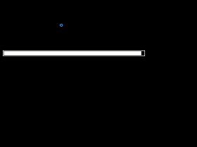

这是完整的演示视频:


如果你也有兴趣把这个游戏保存在 stm32 上，可以跟着后面的教程，或者也可以在这个项目里直接找到编译好的固件、游戏和项目源码。

[https://github.com/wuhanstudio/stm32-ufun-3d-game](https://github.com/wuhanstudio/stm32-ufun-3d-game)

### 1. 运行 RT-Thread

RT-Thread 在 github 上是开源的，源码可以在[这里](https://github.com/rt-Thread/rt-thread/)找到，官网文档也很丰富这里就不重复了，总结一下需要的工具：

- Git Bash
- Keil 开发环境
- stm32 开发板 
- RT-Thread 源码
- env 工具

如果觉得从 github 上面下载 rt-thread 源码比较慢，可以先从 gitee 上面下载，然后修改项目地址。

```
git clone https://gitee.com/rtthread/rt-thread
cd rt-thread
git remote rm origin
git remote add origin https://github.com/RT-Thread/rt-thread 
git pull origin master
```

### 2. 片上 Flash 文件系统

准备好第一步里面的工具后，首先我们需要把 stm32 的片上 flash 挂载为文件系统，首先需要在 CubeMX 里使能 USB。

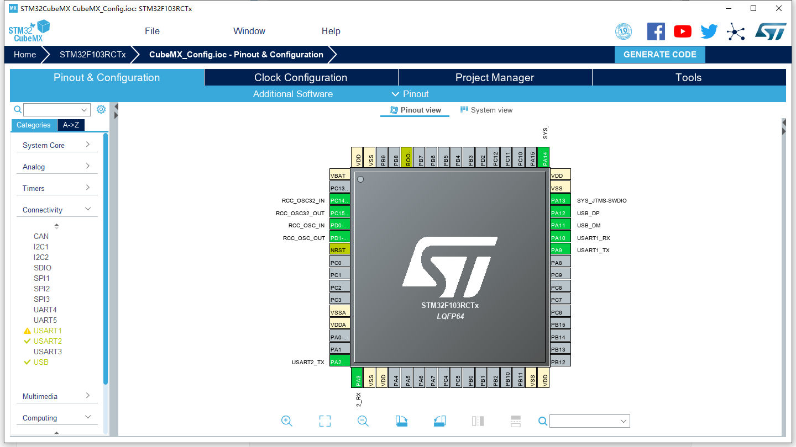

打开 USB 后在时钟配置里确认外部晶振和板子上的晶振是一致的，并且 USB 的时钟是 48MHz，就可以点击生成代码了。由于我们修改了时钟，需要把 board/CubeMX_Config/Src/main.c 里面的 **void SystemClock_Config(void)** 函数复制到 board/board.c 里面替换。

接下来修改 bsp 下 board 目录里的 Kconfig 文件。

    config BSP_USING_ON_CHIP_FLASH
        bool "Enable on-chip FLASH"
        default n 
    
    config BSP_USING_USBD_FS
        bool "Enable USBD as USB device"
        select RT_USING_USB_DEVICE
        default n
这样再在 bsp 目录下右键 ConEmu Here 就可以看到配置界面 ([Env 教程](https://www.rt-thread.org/document/site/tutorial/env-video/))，依次选中下面几个选项：

1. Hardware Drivers Config --> Enable on-chip Flash

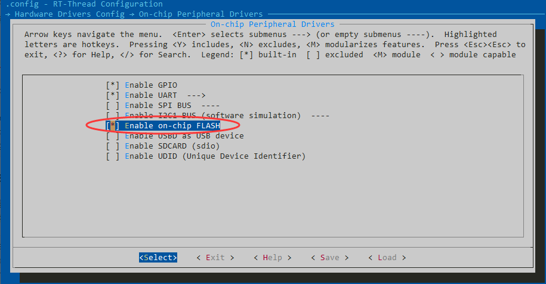

2. RT-thread Components --> Device Drivers --> Using MTD Nor Flash device drivers


3. RT-Thread online packages --> system packages 选中 fal 和 Littlefs

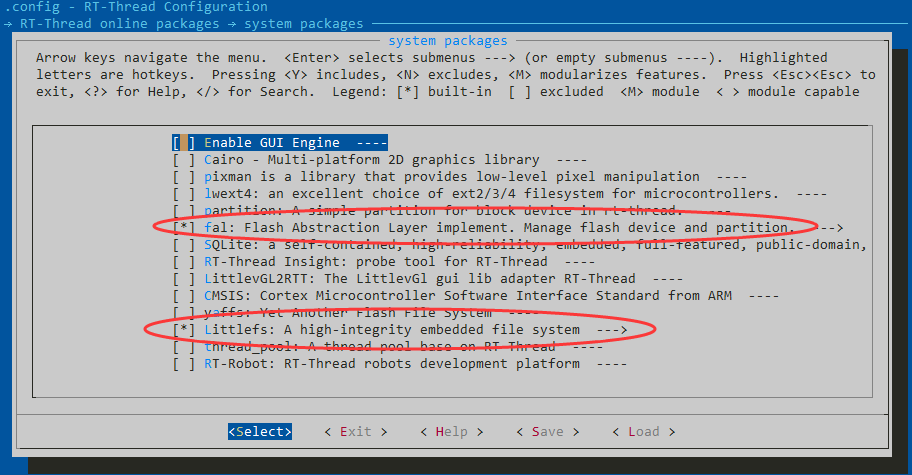

4. RT-Thread Components --> Device virtual file system

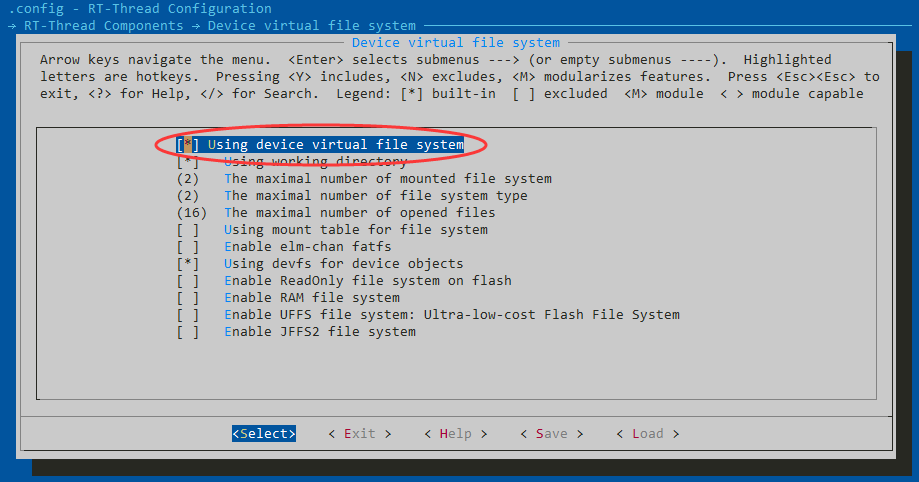

保存配置退出，在 env 里面输入命令就可以自动生成 Keil 项目了：

```
pkgs --update
scons --target=mdk5 -s
```

我们需要先对 flash 进行规划，STM32F103RC 一共有 256KB，可以把最后的 128KB 作为文件系统使用，于是新建一个 fal_cfg.h：

```
extern const struct fal_flash_dev stm32_onchip_flash;
	
#define FAL_FLASH_DEV_TABLE                                          \
{                                                                    \
    &stm32_onchip_flash,                                           \
}

#define FAL_PART_TABLE                                                          \
{                                                                               \
    {FAL_PART_MAGIC_WROD,       "app", "onchip_flash",         0,   128*1024, 0}, \
    {FAL_PART_MAGIC_WROD,      "flash0", "onchip_flash",   128*1024,  128*1024, 0}, \
}
```

再修改 main.c 挂载文件系统：

```
#include <rtthread.h>
#include <rtdevice.h>
#include <board.h>
#include <fal.h>
#include <dfs_posix.h>

/* defined the LED0 pin: PC13 */
#define LED0_PIN    GET_PIN(C, 13)

#define FS_PARTITION_NAME  "flash0"

int main(void)
{
    int count = 1;
    /* set LED0 pin mode to output */
    rt_pin_mode(LED0_PIN, PIN_MODE_OUTPUT);

    fal_init();

#ifdef RT_USB_DEVICE_MSTORAGE
    struct rt_device *flash_dev = fal_blk_device_create(FS_PARTITION_NAME);
#else
    struct rt_device *flash_dev = fal_mtd_nor_device_create(FS_PARTITION_NAME);
#endif

    if (flash_dev == NULL)
    {
        rt_kprintf("Can't create a block device on '%s' partition.\n", FS_PARTITION_NAME);
    }
    else
    {
        rt_kprintf("Create a block device on the %s partition of flash successful.\n", FS_PARTITION_NAME);
    }
    
    while (count++)
    {
#ifndef RT_USB_DEVICE_MSTORAGE
        if(rt_device_find(FS_PARTITION_NAME) != RT_NULL)
        {
            dfs_mkfs("lfs", FS_PARTITION_NAME);

            if (dfs_mount(FS_PARTITION_NAME, "/", "lfs", 0, 0) == RT_EOK)
            {
                rt_kprintf("sd card mount to '/'\n");
                break;
            }
            else
            {
                rt_kprintf("sd card mount to '/' failed!\n");
            }
        }
#endif
        rt_pin_write(LED0_PIN, PIN_HIGH);
        rt_thread_mdelay(500);
        rt_pin_write(LED0_PIN, PIN_LOW);
        rt_thread_mdelay(500);
    }

    return RT_EOK;
}
```

项目编译下载到板子上，串口连接上去在 msh 里输入 **fal probe** 应当就可以看到分区表了：

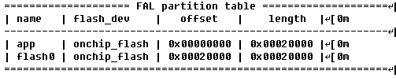

Linux 下常用的命令 **ls** ，**cat**，**mkdir**，**cd** 也都是支持的，这样我们就把 stm32 的片上 flash 挂载为文件系统了， 下一步就是让它识别为 U盘。

### 3. 挂载片上 Flash 为 U盘

同样的，我们在 env 的配置目录里面依次选中：

1.  Hardware Drivers Config --> On-chip Peripheral Drivers

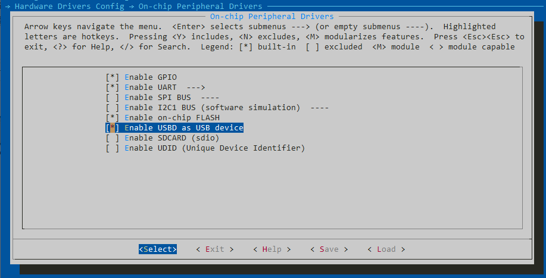

2. RT-Thread Components --> Device Drivers --> Using USB

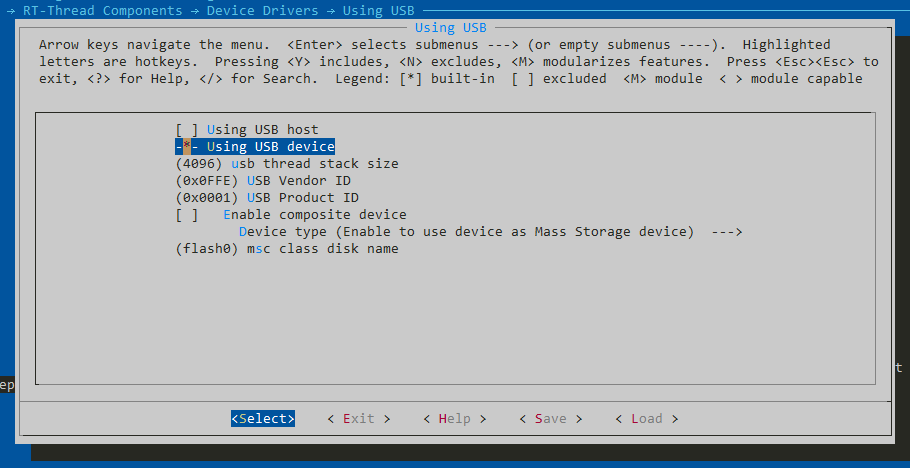

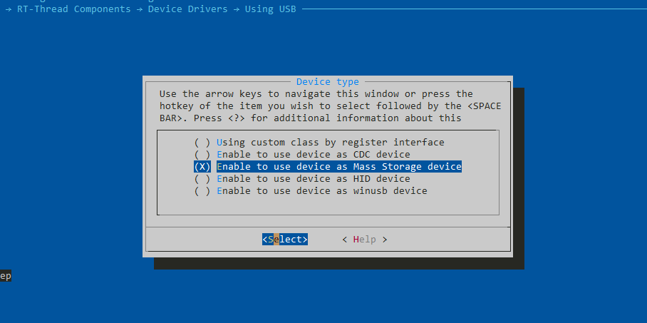

这样保存配置，在 env 下生成项目文件：

```
scons --target=mdk5 -s
```

编译上传到板子上，接上 USB 到电脑，例如 stm32f103 的 USB 引脚是 PA11 和 PA12，就可以看到电脑识别到一个新的 U盘了，第一次使用可能需要先格式化。


最后其实就只是把高压的游戏复制进去，就把它装进 STM32 的片上 flash 了，其实还是挺简单的。

完整的项目地址在这里：

[https://github.com/wuhanstudio/stm32-ufun-3d-game](https://github.com/wuhanstudio/stm32-ufun-3d-game)

